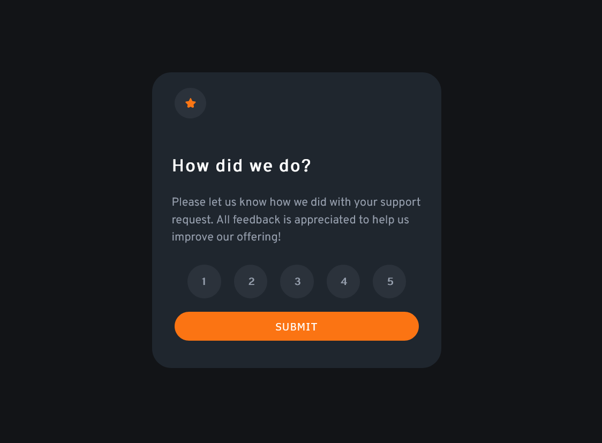

# Frontend Mentor - Interactive rating component solution

This is a solution to the [Interactive rating component challenge on Frontend Mentor](https://www.frontendmentor.io/challenges/interactive-rating-component-koxpeBUmI). Frontend Mentor challenges help you improve your coding skills by building realistic projects. 

## Table of contents

- [Overview](#overview)
  - [The challenge](#the-challenge)
  - [Screenshot](#screenshot)
  - [Links](#links)
- [My process](#my-process)
  - [Built with](#built-with)
  - [What I learned](#what-i-learned)
  - [Continued development](#continued-development)
  - [Useful resources](#useful-resources)
- [Author](#author)
- [Acknowledgments](#acknowledgments)

**Note: Delete this note and update the table of contents based on what sections you keep.**

## Overview

### The challenge

Users should be able to:

- View the optimal layout for the app depending on their device's screen size
- See hover states for all interactive elements on the page
- Select and submit a number rating
- See the "Thank you" card state after submitting a rating

### Screenshot
 

### Links

- Live Site URL: [(https://rating-box.netlify.app/)]

## My process

### Built with

- Semantic HTML5 markup
- CSS custom properties
- CSS Grid
- JavaScript

### What I learned

- Working with a responsive mind-set is vital from the beginning (I ran into issues due to my failures of doing this from the start of the project)

### Continued development

- Moving forward I would like to improve on my skills in making my pages and components responsive 
- Improving using CSS Grid and Flexbox
